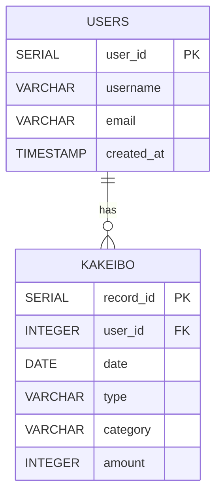

# DB設計書

- [データベース情報](#データベース情報)
- [テーブル定義](#テーブル定義)
  - [ユーザー情報テーブル](#ユーザー情報テーブル)
  - [家計簿情報テーブル](#家計簿情報テーブル)
- [ER 図](#er-図)

# データベース情報

- **DB 論理名**: 家計簿データベース
- **DB 物理名**: kakeibo_db
- **ホスト名** : kakeibo_db_host
- **RDBMS の種類とバージョン**: PostgreSQL 13

# テーブル定義

## ユーザー情報テーブル

- **論理名**: ユーザー情報
- **物理名**: users

| カラム物理名 | カラム論理名   | データ型  | 凡例                        | FK  | PK  | ユニーク制約 |
| ------------ | -------------- | --------- | --------------------------- | --- | --- | ------------ |
| user_id      | ユーザー ID    | SERIAL    | 1                           |     | ○   | ○            |
| username     | ユーザー名     | VARCHAR   | 情報太郎                    |     |     | ○            |
| email        | メールアドレス | VARCHAR   | info_taro@example.dummy |     |     | ○            |
| created_at   | 作成日時       | TIMESTAMP | 2023-01-01 00:00:00         |     |     |              |

## 家計簿情報テーブル

- **論理名**: 家計簿情報
- **物理名**: kakeibo

| カラム物理名 | カラム論理名 | データ型  | 凡例                | FK  | PK  | ユニーク制約 |
| ------------ | ------------ | --------- | ------------------- | --- | --- | ------------ |
| record_id    | 記録 ID      | SERIAL    | 1001                |     | ○   | ○            |
| user_id      | ユーザー ID  | INTEGER   | 1                   | ○   |     |              |
| date         | 日付         | DATE      | 2023-10-01          |     |     |              |
| type         | 収入・支出   | VARCHAR   | income              |     |     |              |
| category     | カテゴリ     | VARCHAR   | salary              |     |     |              |
| amount       | 金額         | INTEGER   | 1000                |     |     |              |

# ER 図

